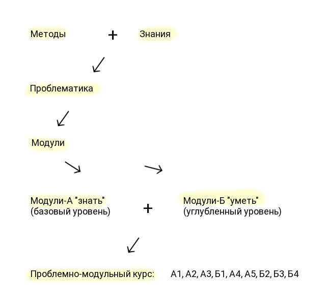

# Проблемно-модульная методика
**Лев Кавелин. Март/17**

Сейчас нет единой, целостной методики создания проблемно-модульных уроков для школьников. В научной литературе, например, в трудах М. А. Чошанова и Е. А. Соколкова есть рекомендации к созданию уроков. Учителя в большинстве своем используют проблемное обучение основываясь на опыте и интуитивном понимании, что подобное обучение эффективно.

Еще  одна проблема в создании методики и уроков —  мы находимся в парадигме существующей системы образования и даже не можем представить, что ее можно изменить.

Этой  методикой я хочу обозначить начало совместной работы, в результате которой мы вместе выработаем единый стандарт для проблемно-модульных  уроков. В процессе создания уроков и их апробации, мы неоднократно будем корректировать методику, совершенствовать методы, форму и содержание.

Я кратко опишу актуальность проблемно-модульных уроков, их плюсы для ученика и учителя. поделюсь наработками о том, как планировать курс уроков. После этого обозначу принципы, на которых строятся такие уроки, а затем, 

Первая редакция методики составлена на материале учебного пособия Соколкова Е.А. “Проблемно-модульное обучение”.

## 1. Актуальность

Познание всегда осуществляет сам человек. Эту работу за него не может выполнить никто. Индивидуальный поиск знаний — суть  учебной работы обучающегося, а весь процесс обучения — это не что иное, как эффективно организованная самостоятельная работа.

Педагог в информационном обществе перестает выступать перед обучающимся в качестве источника первичной информации. Он превращается в посредника, и наставника, который облегчает получение и усвоение большого объема информации, помогает понять, как применить ее на практике.

Соответственно процесс управления обучением должен измениться, он должен перейти от учителю к урокам(информации), что позволит обучающемуся учиться в индивидуальном темпе, а к учителю обращаться только за консультацией, работать в паре или в группе.

Принципиальное отличие проблемно-модульного обучения от других обучающих систем в том,  что содержание обучения представлено в законченных, самостоятельных комплексах-модулях. 

Эти комплексы одновременно являются банком информации, способом постановки проблемных задач и методическим руководством по отработке контрольных позиций проблемно-модульного курса.

Такое содержание позволяют ученикам самостоятельно формировать свои знания и умения, вырабатывать навыки их применения в решении новых познавательных и практических задач, не получая их в готовом виде.

## 2. Устройство проблемно-модульного курса

Во ФГОСах используется системно-деятельностный подход и отражена конкретные навыки/ умения, которыми должен овладеть ученик. Чтобы сделать связку деятельности со знаниями, мы используем компетентностно-ориентировонный подход.

Компетенция — это способность успешно действовать на основе теоретических знаний, методов и практического опыта.

На основе деятельности, которая отражена в ФГОСах, и, например, историко-культурного стандарта, мы формируем проблемно-модульный курс по истории.

При разработке проблемно-модульного курса из учебной программы дисциплины выбираются узловые, актуальные вопросы и темы.  Вместе они представляют целостные проблемно-функциональные узлы. Обычно модуль — это раздел учебной программы или параграф учебника.

Этапы разработки:
* Формирование комплексных дидактических целей программы и курса.
* Выделение известных научных данных, понятий, закономерностей по изучаемым вопросам.
* Составление  блок-схемы проблемно-модульного курса с учетом иерархии целей.
* Составление  переченя необходимых знаний и умений по каждому модулю, предварительно разбив их на позиции. 
* Проанализировать содержания каждого модуля и обеспечить готовность обучающихся к изучению учебного материала за счет использования ранее освоенных знаний
* Изображение структурно-логической схемы графом или генеалогическим деревом, нумерация элементов модулей и позиций, чтобы дать возможность обучающимся сформировать «траекторию» изучения учебной дисциплины.
* Представление  содержания основных учебных элементов в теоретическом и практическом блоках проблемно-модульного курса.

Кроме этого определяется базовая подготовленность, которую должен иметь обучающийся в начале работы с пролемно-модульным курсом. Формируется диагностический тест базовой подготовленности.

Апробация курса происходит путем наблюдения, тестирования, анкетных опросов, устных опросов обучающегося и педагога.

## 3. Устройство проблемно-модульного урока

Модуль представляет собой логически завершенный блок учебного материала. Он включает в себя цели и учебную задачу, методические рекомендации, ориентировочную основу действий и описание средств контроля (самоконтроля) обучения. Минимальная учебная единица модуля — элемент модуля.

Структура модуля:
* Проблемная ситуация и краткая обобщеная теория.
* Объяснение — элементы модуля с детальной теорией и текущим контролем для закрепления информации.
* Элемент модуля дидактическая цель которого заключается в резюме модуля: ,описание выводов, графическое изображение, схема. 
* Выходной контроль.

Модуль содержит учебную литературу, изображения, видео и аудио материалы, диаграммы, схемы, тесты, вопросы для самоконтроля.

## 4. Проблемная ситуация

Обучение должно ориентироваться на зону ближайшего развития личности, находящуюся между актуальным и потенциальным уровнями. Задания для обучающегося должны быть сложными настолько, чтобы не было назойливой педагогической опеки.

Модули за счет содержания должны создавать условия для активной познавательной деятельности, заменяя пассивное чтение текста или слушание монотонного голоса педагога.

Проблемная ситуация — это познавательная задача, которая характеризуется противоречием между имеющимися знаниями, умениями, отношениями и предъявляемыми к ним требованиями.

Требования к учебной проблеме:
* Учебная проблема должна быть связана с предъявлением учебного материала и логически вытекать из него.
* В формулировке вопроса, задачи или практической ситуации, связанных с учебной проблемой, должна отражаться противоречивая информация. 
* Cодержание проблемы должно указывать направление и путь ее решения.
* Решение проблемы должно быть посильным для учащихся, но не очень легким.
* Речевая формулировка проблемы должна состоять из предложений, содержащих известные обучающемуся понятия, при этом в предложениях должны быть элементы, которые имеют связь с неизвестным в самой проблеме.
* Проблемные вопросы, учебные практические задачи, примеры из жизни, приводимые при постановке проблем, должны оказывать эмоциональное воздействие на обучающегося, побуждать его к активной деятельности.

Для постановки проблемных вопросов предлагаются противоречия в социально-экономическом и нравственно-политическом развитии современного общества.

Выявление противоречий, их раскрытие и разрешение приближает школьника к ситуации самостоятельного открытия знания, вооружает его средствами «добывания» нового. Это ориентирует его на перспективу развития и применения этого знания.

**Проблемы для гуманитарных наук**

Это проблемы социально экономического развития общества.  Предлагаем ученику анализировать исторические предпосылки и на этой основе разрабатывать предложения по совершенствованию социальных и национальных отношений, развитию социально-толерантной и национальной структуры и стабильности общества. 

Также можно использовать проблемы диалектики войны, мира, революции, экономики, благосостояния народа, внутренней и внешней политики и т.д.

Чтобы активизировать учебный процесс, решенные в науке вопросы нужно представлять как проблемные, только ожидающие своего решения.

**Изложение проблемности** 

Предлагается проблемная ситуация. Затем привлекается информационный и аргументированный материал, в котором ученик находит разрешение проблемного вопроса. Можно показать как были добыты те или иные знания, объяснить причины, которые повлияли на их развитие.

Другой прием — сопоставить разные точки зрения по одному вопросу.

**Единство теории и практики**

Проблемность необходимо рассматривать как средство применения теоретических знаний в реальной жизни, учитывая, что она гораздо сложнее, противоречией и изменчивей.

Этот прием помогает научить школьников искать проявления закономерностей в повседневных событиях обнаруживать проявления закономерностей, усматривать в явлениях сущность. 

Важно донести мысль о том, что мало глубоко изучить гуманитарные науки, запомнить теорию, необходимо научиться пользоваться полученными знаниями и навыками в повседневной жизни.

Чтобы избежать фрагментарности знаний, принцип проблемности дополняет информационно-описательный принцип.

## 5. Важность наглядности

Средства наглядности — важнейший элемент проблемно-модульного обучения. Эта наглядность отличается от наглядности при объяснительно-иллюстративном методе. 

В случае с объяснительно-иллюстративном методом наглядность —  это демонстрация, констатация, утверждение или отрицание материала. Она несет обучающую информацию в готовом виде. При таком восприятии требуется волевое усилие для восприятия, так как отсутствует атмосфера творческого поиска. 

Наглядность в проблемно-модульной системе несет определенную поисковую нагрузку.

Помогает частичному формированию проблем, которые необходимо решать дальнейшем.

Убеждает в достоверности сделанного учеником «открытия»

Играет ведущую роль при закреплении и систематизации приобретенных знаний.
    
## 6. Дидактические принципы написания проблемно-модульных уроков

**Проблемно-модульность**
* Учебный материал конструировать так, чтобы он помогал каждому ученику  достигать поставленную перед ним дидактическую цель. 
* Учебный материал должен быть представлен настолько законченным блоком, чтобы была возможность конструировать единое содержание обучения, соответствующего комплексной дидактической цели, из отдельных модулей. 
* В соответствии с учебным материалом следует интегрировать различные виды и формы обучения, подчиненные конечной общей цели.
модуль как организационно-методическая структурная единица в рамках одной учебной дисциплины, включает в себя дидактические цели, логически завершенную единицу учебного материала, составленную с учетом внутрипредметных связей, методическое руководство (с дидактическими материалами) и систему контроля
* Критерии проблемных вопросов - актуальность, практическая направленность и важность в содержание курса, сложность и противоречивость, а также трудноусвояемость в понимании обучающимися.

**Структурирование содержания обучения**
* Обеспечивается логическая направленность материала на практическую часть учебной дисциплины.
* Содержание формируется по функциональному признаку, то есть вокруг функций, способов, приемов познавательной направленности.
* В структуре реализации дидактической цели следует выделять в содержании модуля две частные цели, которые решают отдельные элементы (позиции).
* Для достижения частных целей  модуль необходимо обеспечить учебным и наглядным материалом (литература, схемы, диаграммы).
* Совокупность элементов (позиций), служащих достижению частных целей, должна составлять один модуль.

**Динамичность**
* Учебный материал должен постоянно перерабатываться и обновляться, с учетом динамики социально-экономического развития общества, его заказа и личности.

**Метода деятельностного подхода**
* Меняется содержание образования: не информация о деятельности плюс немного деятельности, а деятельность, основанная на информации. при этом в качестве содержания образования выступает как профессиональный, так и социокультурный контекст.
* Цели должны формироваться в терминах метода деятельности (практической, познавательной, интеллектуальной).
* Для достижения поставленной целей возможно как предметное, так и межпредметное построение содержания модулей в рабочих курсах.

**Гибкость**
* Возможность приспособления содержания обучения и направлений его усвоения к индивидуальным потребностям обучающегося.
* При индивидуализации содержания обучения необходима исходная диагностика знаний.
* Соблюдение индивидуального темпа усвоения учебного материала.
* Контроль и самоконтроль после достижения определенной цели обучения.

**Осознанная перспектива**
* Всякий процесс управления начинается с формулировки цели. значит, если в учебном процессе использовать возможность самоуправления обучающихся, на что и нацелена активизация познавательного процесса, то необходимо дать им ясно понять и осознать цель.

**Паритетность**
* Проблемно-модульная программа должна создавать условия для более оптимального взаимодействия педагога с обучающимся.
* Преподаватель в рассматриваемой технологии должен делегировать отдельные функции управления программе и рабочему курсу, в которых эти функции трансформируются в функции самоуправления.

**Реализация обратной связи**
* Методическое обеспечение контроля усвоения содержания обучения.
* Текущий контроль в конце каждого учебного элемента, рубежный — в конце проблемно-модульного курса.

**Выделение из содержания обучения обособленных элементов**
* Учебный материал большого размера запоминается с трудом.
* Учебный материал, компактно расположенный в определенной системе, облегчает восприятие.
* Выделение в изучаемом материале смысловых опорных пунктов способствует эффективному запоминанию.
* Наименьшая единица содержания модуля отвечающая конкретной дидактической цели называется элемент модуля.
* Укрупнение дидактических единиц позволяет без ущерба на 30% ускорить обучение.

Кроме принципов проблемно-модульной технологии используются общедидактические принципы научности, системности, принцип наглядности, принцип прочности знаний.

## 7. Контроль
Текущий, промежуточный, обобщающий (выходной) контроль в модуле.

Текущий и промежуточный может осуществляться в виде самоконтроля. Обобщающий контроль должен показать уровень освоения всего модуля, а также отослать к неусвоенным конкретным элементам модуля.

Тесты первого уровня используются для проверки качества усвоения на уровне «узнавание». К ним относятся: задания на опознание, различие, классификацию объектов, явлений и понятий. Тесты на опознание содержат одну существенную операцию - выбор из альтернатив «да — нет». В тестах на различие содержатся «помехи», которые создаются наличием ряда вариативных ответов.

Тесты второго уровня используются при проверке качества усвоения деятельности, на основе которой обучающийся способен самостоятельно воспроизводить усвоенные знания, навыки и умения и применять их в типовых ситуациях, не требующих создания новой информации (репродуктивная деятельность). К тестам второго уровня относятся «тесты-постановки», в которых намеренно пропущено слово, фраза, формула или другой существенный элемент текста. Другой разновидностью тестов второго уровня могут выступать конструктивные тесты или типовые задачи.

Тесты третьего уровня конструируют для диагностики усвоения на уровне продуктивного действия: обсуждение известных объектов, изучение и продуцирование новой информации о них, применение учебного материала для решения нетиповых ситуаций и задач в реальной практической деятельности.

Выполняя тест второго уровня, обучающийся применяет известный ему способ деятельности в знакомой обстановке, а при выполнении теста третьего уровня решается вопрос об использовании способа известной обучающемуся деятельности в новой, нестандартной ситуации.

-------------------------------------------------------------------------------------------
P.S. Для примера я сделал [урок](https://lessons.kavelin.academy/ru/languages/russian/01-Proiznoshenie-i-zapis-zvukov.html) по русскому языку. В нем не представлена наглядность, методических рекомендаций и упражнения, но оно дает общее представление о направлении.

Что еще не сделано в методике и требует вашей помощи: 
* Временно связать с ФГОС комплексные дидактические цели, выделить модули типов А и Б, совместить их с компетенциями «знать» и «уметь».
* Разработать систему оценивания (зачетные единицы оценки , «кредитная» система, «доверие»).
* Учесть инклюзивное образование.
* Определить оптимальное время на урок.
* Внешний вид урока
* Межпредметные связи.
* Наверно, что-то еще.

Методика ориентирована на создание уроков, которые будут подходить для школьников возраста 5-11 классов.
